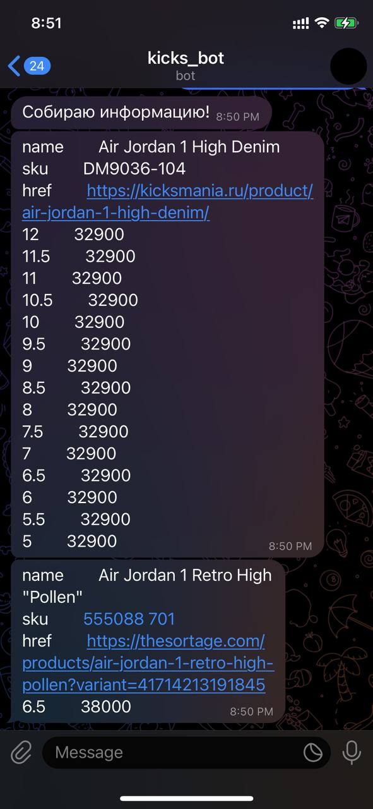
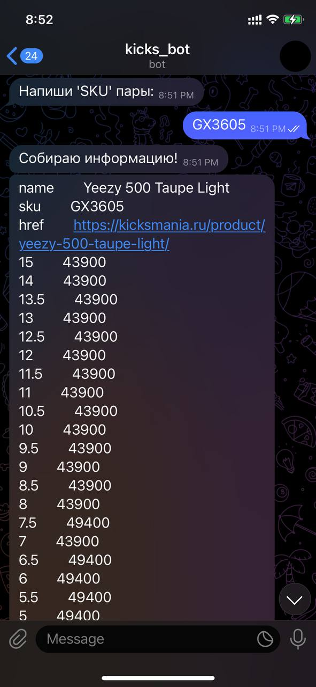
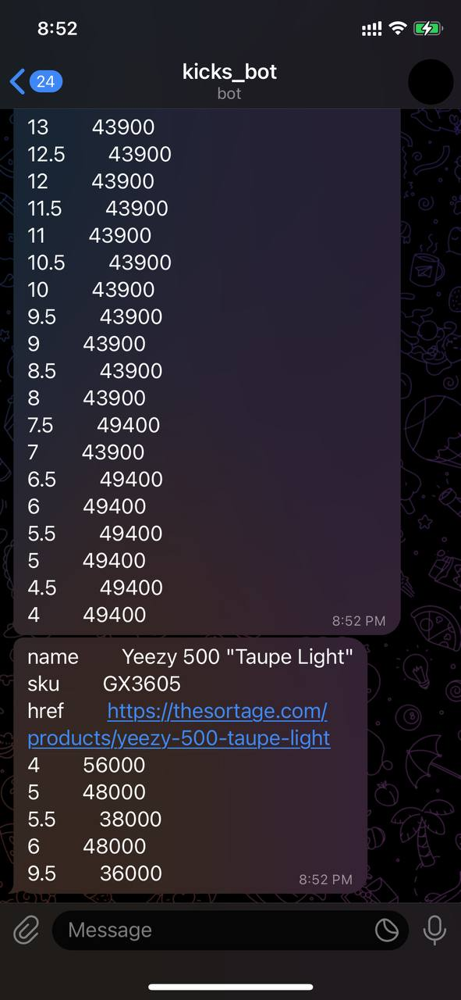
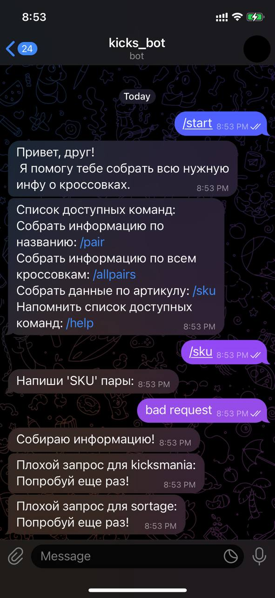
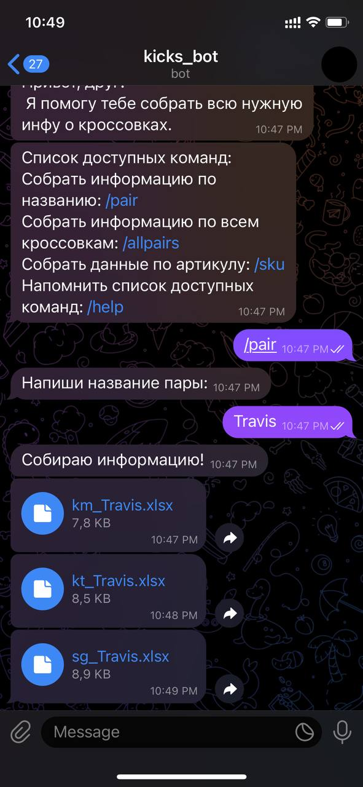
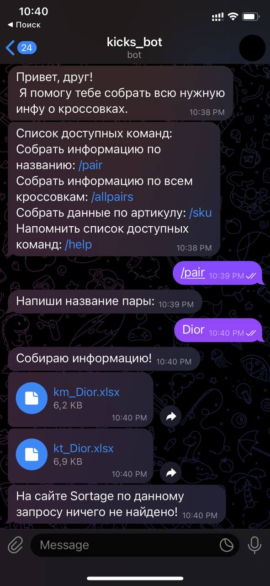
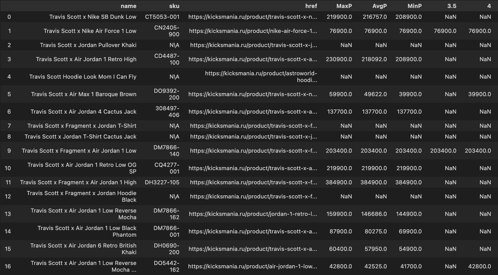

## Предложение по парсеру/боту KicksMania, KicksTown, TheSortage. 
#### Что готово на данный момент со стороны парсера(сбор данных) (бэкэнд):

1. ##### Сбор данных по узкому запросу. Команда `/sku`
   
  * Запросы вида: `/sku jordan high 1`   - возвращает первое совпадение с kicksmania, sortage (1)
  * Запросы вида: `/sku GX3605` - возвращает информацию по совпадению с kicksmania, sortage (2, 3) 
  * В случае, если на одном из сайтов нет результатов по запросу, бот сообщает о некоректном запросе (4)

   

2.  ##### Сбор данных по широкому запросу команда `/pair`

* Запрос вида `/pair travis` возвращает три таблицы: **kicksmania, sortage, kickstown** (1)
* Запрос вида `/pair dior` возвращает только таблицы с **kicksmania** и  **kickstown**, так как на **sortage** нет dior (2) 

 

3.  ##### Вид таблицы:

* [Таблица](https://docs.google.com/spreadsheets/d/1swK-CbooWvODhLrdaLen8xsmnxoNcPreTsifsK5MBGo/edit?usp=sharing) содержит `n` строк c параметрами `{name, sku, href, MaxPrice, AvgPrice, MinPrice, размеры (3.5. - 15)}` ([пример по ссылке](https://docs.google.com/spreadsheets/d/1swK-CbooWvODhLrdaLen8xsmnxoNcPreTsifsK5MBGo/edit?usp=sharing))
* На пересечении строки и столбца с размером возможны два вида значений:
* NaN (пустая клетка) обозначает, что на сайте данного размера в наличии нет 
* Цена (69990) - отражает наличие пары у конкурентов

 

#### Что не готово на данный момент со стороны парсера (сбор данных) (бэкэнд):

1. ##### Необходимо добавить обработку исключений:

* 22.5 EUR размеры --> в рамер US [прим.](https://msc.kickstown.ru/index.php?route=product/product&path=59&product_id=1400)
*  9.5W --> в размер US [прим.](https://thesortage.com/products/dunk-low-white-black-dd1503-101?variant=41713980965029)
*  Кривая страница [прим.](https://msc.kickstown.ru/index.php?route=product/product&product_id=1556)
*  Отсутствие таблицы с ценами на размеры (в таком случае будем выдавать номинальную) [прим.](https://msc.kickstown.ru/index.php?route=product/product&product_id=1952&search=dior)
  

2. ##### Команды
		
* Добавить запрос `/sku` для kickstown, найти метод, позвляющий отобразить корреткную пару по артикулу, т.к. на [kickstown](https://msc.kickstown.ru/index.php?route=product/product&path=59&product_id=1400) не указаны артикулы (соответственно, по ним нельзя сделать поиск) 
* Добавить `/allpairs` - возможность сбора информации по всем парам на трех сайтах
* Добавить функционал, позволяющий менять IP адрес запроса бота. Это необходимо для того, чтобы конкурнеты не узнали, что их данные собирают; также позволит увеличить скорость сбора данных засчет меньшего интервала между запросами.

#### Что готово по телеграм боту (фронтэнд): 
	
   * В случае некорректного запроса сообщает пользователю об ошибке
   * Корректно выдает ответы на запрос `/sku`
   * Корректно выдает ответы на запрос `/pair`
   * Локально работает без ошибок на разных примерах и множестве различных запросов

#### Что не готово по телеграм боту (фронтэнд):

* На данный момент бот работает локально (запускается на стационарном компьютере/ноутбуке), в дальнейшем его необходимо перенести на сервер для автономной работы и доступа **24/7** 
* Добавить меры **безопасности** (доступ будет только у ограниченного круга людей)
* Добавить **логи** использования (для того, чтобы менеджмент мог видеть и по потребности проверять: кто, как и когда пользовался)

## Что предлагаем: 

### Сроки:

Для отладки всех вышеописанных процессов понадобится примерно месяц. 80% проблем и доработок будут сделаны в течение 2 недель; более технически тонкие моменты займут остальное время. Также сделаем тестовый период для того, чтобы понять, какие улучшения можно сделать для пользователей (отдел закупок)
	
### Условия: 

После сдачи проекта, весь код экслюзивно ваш (передадим вам репрезиторой и все файлы) и сможем поддерживать работу в течение обговоренного периода. Поддержание работы подразумевает обработку кода, который изначально мог быть написан некорректно (редкие, но возможные случаи), но не подразумевает экстраполяцию на новые площадки, добавление функционала и тд. (При необходисти обьясним весь код и процессы вашему специалисту для дальнейшего поддержания/обновления функционала вашим специалистом)

### Цена : 

Для вышепоставленной задачи мы видим цену в $5000, проект займет суммарно от 6 до 8 недель (датой начала считаем 15 марта). Формат, сроки и этапы оплаты хотелось бы обсудить в личной беседе.

	
	
	
		

